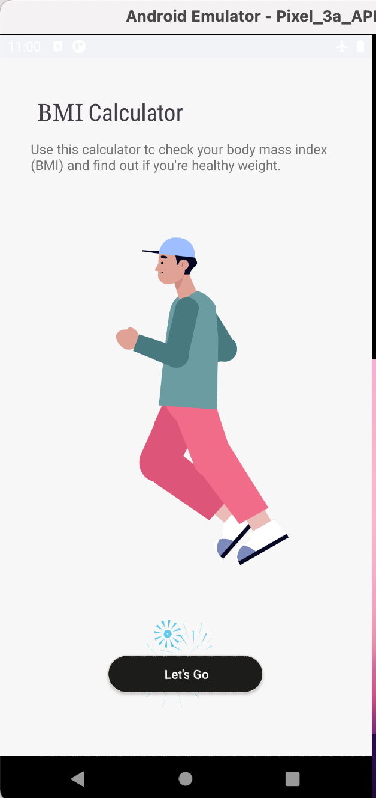
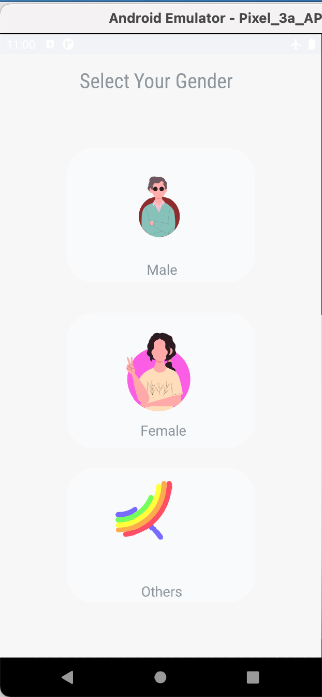
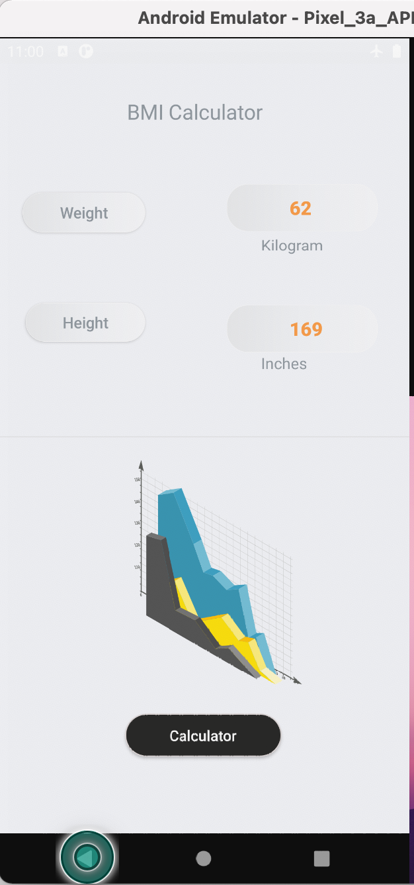
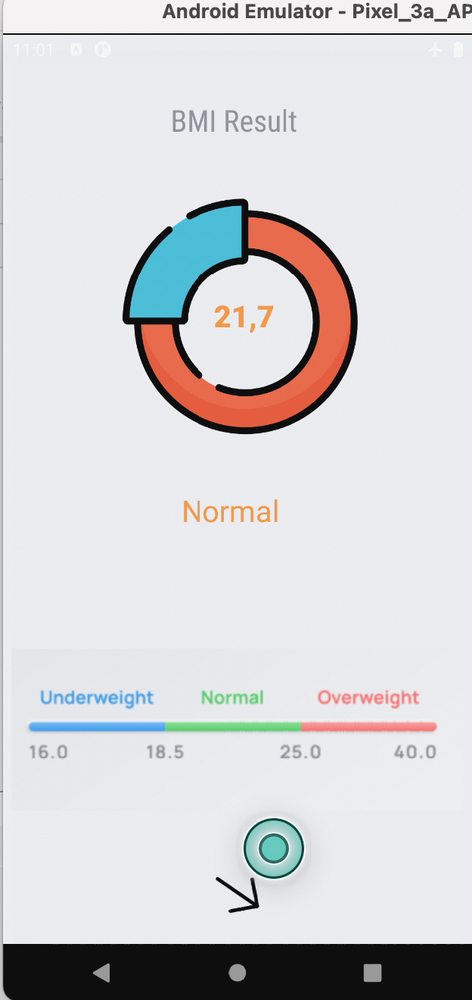

# App BMI Calculator - java - Android
## Version 1.0.0
## 
1. [Links downd](https://drive.google.com/file/d/1IDT-IixJic5aCsfVLOBwVT-9w43s1DAh/view)
## Design : 
   1. 
    
   2.   
   3. 
   4. 
## Video demo 

1. 

## Bản quyền thuộc về nhà phát triển : Nguyễn Đức Thông.
1.  [Facebook : Nguyễn Đức Thông](https://www.facebook.com/1824ttd)
2.  [Youtube : Coding dev](https://www.youtube.com/channel/UC_LxMTkXp7ESyYM3Zv8XwIw)
3.  [Github : thong2802](https://github.com/thong2802)